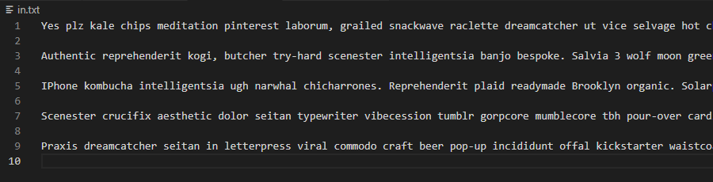
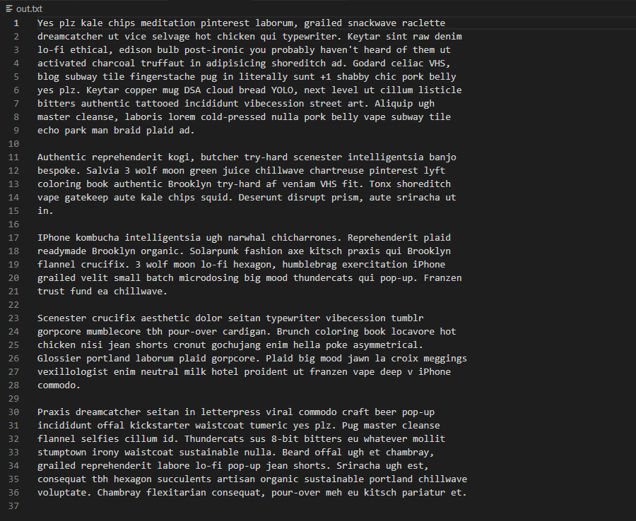

# TXT Auto-Spacer

If you're like me and sometimes share text files in a medium that indiscriminately cuts lines of text short (like a CLI terminal), then you could probably use a script to format your text files so a linebreak doesn't happen in the middle of a word and it's all handled automatically. Look no further.

Formats a txt file so that lines are no longer than a certain length (default is 80 characters) without breaking in the middle of a word. Line breaks will be placed at the location of the last space character before the line limit was reached.

## Example

Turns this:

Into this:

## Requirements 

NodeJS/NPM/NPX

## Configuration

The `config.js` file is where you set the relative path of your **input file** and **output file**.
You can also configure the **maximum length of each line** in the output file.

## Use

No package dependencies, so no install command is required.

Configure your in and out files, then run `npm run start` or `node main`.
